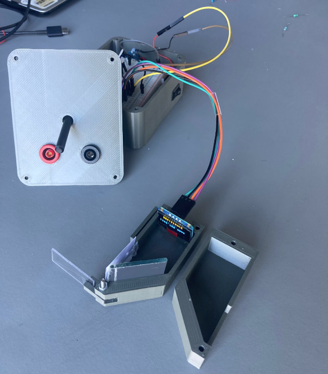

# Smart Multimeter

A homemade multimeter built in 2024 for the second semester project of the BEng
in Mechatronics at SDU. It measures resistance and capacitance on an ATmega328P
and shows the readings on a head-mounted display: a small OLED reflected onto a
transparent panel, so the measurement stays in view while both hands are on the
probes.

## What's inside

- `src/main.c`: the firmware, written in C directly against the AVR registers
  without the Arduino framework. ADC setup and channel switching, a Timer1
  millisecond counter with its own interrupt, USART, and the measurement routines.
- `include/`, `lib/`, `test/`, `platformio.ini`: standard PlatformIO layout
- `REPORT SPRO-2 G7.pdf`: full project report

## How it measures

Resistance through a voltage divider against a 10 kΩ reference resistor.
Capacitance by timing how long a capacitor takes to charge through a known
resistor.

## Running it

Open the folder in VS Code with the PlatformIO extension and build. Target board
is an Arduino Nano (ATmega328P). The `build_flags` in `platformio.ini` link the
float versions of printf, which the display output needs.

## Third-party code

The firmware in `main.c` is mine. The drivers it builds on are not:

- `ssd1306.c`, `twi.c`: SSD1306 OLED driver and I2C, by Marian Hrinko
- `twimaster.c`: I2C master library by Peter Fleury (GPL)
- `lcd.c`, `lm75.c`, `usart.c`: from the SDU course material

## Status

Final version submitted in August 2024, last verified on hardware then. Voltage
mode was left unfinished. Not maintained.
